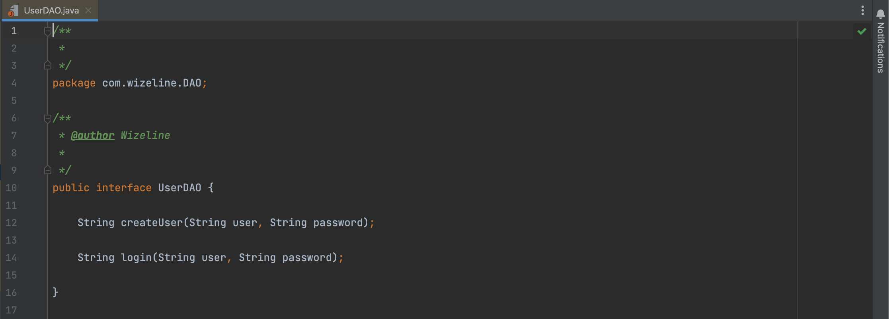
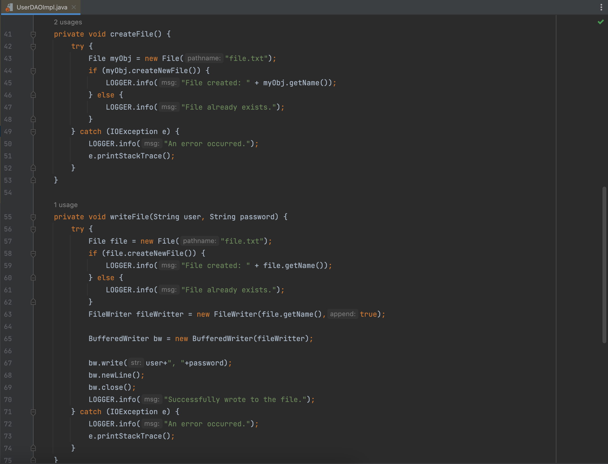
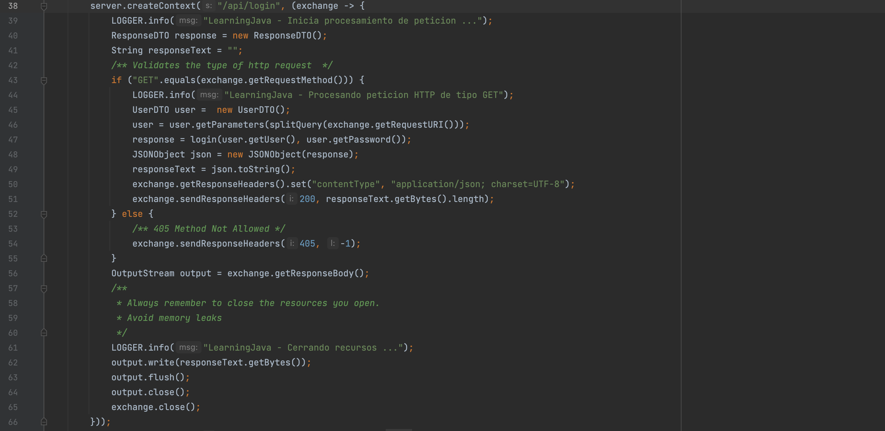
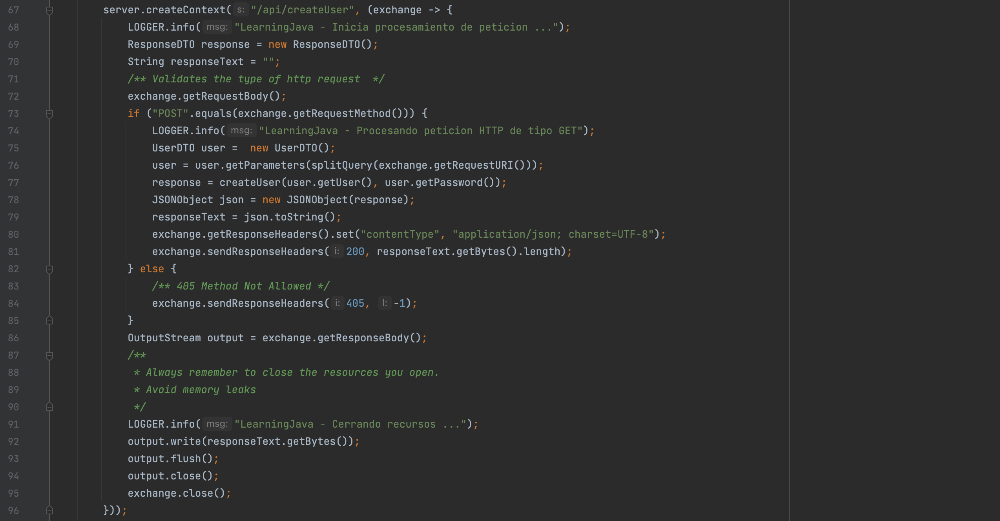
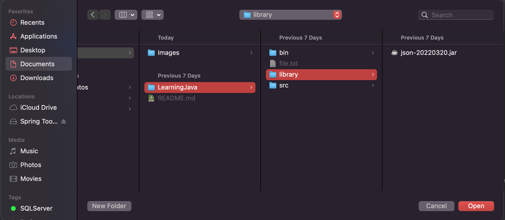

# Java
Recursos y pasos importantes para el curso

# :computer:  Actividades

## Pre-requisitos de la sesión en vivo :exclamation:

Para realizar este curso es importante tener instalado los siguientes programas::
* [JDK 11](https://www.oracle.com/java/technologies/downloads/)
* [Intellij Idea Community](https://www.jetbrains.com/idea/download/#section=windows)


## Java línea de comando
Una vez que JDK y Intellij fue descargados e instalados, procederemos a validar que este bien instalado para comenzar las pruebas

### PASO 1: Validar entorno
Abrimos una terminal y validamos si reconoce nuestra versión de Java:

``` bash
# Iniciamos validando que nuestra consola reconosca la versión de Java

jonathan.torres@Jonathans-MacBook-Pro LearningJava1.2 % java -version
java version "11.0.15" 2022-04-19 LTS
Java(TM) SE Runtime Environment 18.9 (build 11.0.15+8-LTS-149)
Java HotSpot(TM) 64-Bit Server VM 18.9 (build 11.0.15+8-LTS-149, mixed mode)

```


## Temario Día 1

### Clases

Conceptos de clases y estructura.

### Herencia

Definición e implementación de herencia.

### Sobrecarga de métodos

Función e implementación de métodos sobrecargados.

### Sobrecarga de constructores

Función e implementación de constructores sobrecargados.


## Temario Día 2

### Encapsulamiento

Conceptos e implementación de encapsulamiento.

### Clases Internas

Definición e implementación de encapsulamiento.

### Paquetes

Función e implementación de paquetes.

### Interfaces

Función e implementación de interfaces.


## Practica
La practica y ejercicios las podemos encontrar en el directorio de practica

### A continuación, se listaran los pasos para a seguir para la actividad de este módulo.

1 . Comenzamos abriendo nuestro IntelliJ y vamos a la opción de crear nuevo proyecto Java.


2. IntelliJ nos muestra nuestro proyecto Java.


3. Ahora vamos a crear en nuestra carpeta src los siguientes paquetes:
  - com.wizeline.BO
  - com.wizeline.DAO
  - com.wizeline.DTO
  - com.wizeline.utils
  - com.wizeline


4. Comenzaremos a crear los siguientes DTO:
  - UserDTO.java
  - ErrorDTO.java
  - ResponseDTO.java


5. Ahora pasamos a generar unas cuantas utilerias que nos ayudaran a realizar valiaciones de datos:


6. Pasamos a la creación de Interfaces, en este caso primero comenzaremos con la interface DAO "UserDAO.java":



7. Creamos ahora la clase de implementación "UserDAOImpl.java" para la interface anterior. Adicional, crearemos algunos métodos para escribir un archivo.





8. Ahora crearemos la interface BO "UserBO.java":


9. Ahora también crearemos la clase de implementación "UserBOImpl.java" para la interface anterior:


10. Ahora vamos a crear nuestra clase main dentro del paquete com.wizeline cuyo nombre será "LearningJava.java".

11. Crearemos el siguiente método dentro de la clse "LearningJava.java" y lo usaremos para recuperar la URI y parámetros:


12. Ahora vamos a crear un método para vaciar los paramtros recibidos, podemos crear un solo metodo ya que para este ejercicio usaremos el mismo DTO:


13. A continuación, comenzaremos con la parte complicada ya que vamos a crear el servidor para nuestro servico Rest. Definimos nuestro método main:


14. Vamos a crear 2 métodos los cuales serán expuestos para puedan ser consumidos desde Postman:

  - Primero método con URL /api/login:


  - Primero método con URL /api/createUser:


15. Finalmente creamos las funciones para iniciar nuestro server:


16. Al llegar aquí seguramente tengas un error en la clase Main, esto se debe a que no reconoce la función JSONObject, bien pues esto lo vamos a solucionar ahora:

  - Solo necesitaremos agregar la libreria "json-20220320.jar" a nuestro proyecto java, a continuación tenemos el proceso:





17. Pasemos a ejecutar desde IntelliJ nuestra aplicación Java. Si todo lo hicimos correctamente debería poder ver el arranque de nuestra aplicación.

18. Puedes descargar de la siguiente liga la colección de Postman que usaremos para consumir nuestros servicios:

* [LearningJava.postman_collection.json:] (/Postman/LearningJava.postman_collection.json)


# :books: Para aprender mas
* [Java:] (https://dev.java)
* [Java Documentation:] (https://docs.oracle.com/en/java/)
* [Learn Java:] (https://dev.java/learn/)
* [Frequently Asked Questions (FAQs):] (https://dev.java/learn/faq/)
* [Java Youtube:] (https://www.youtube.com/java)
* [JRE/JDK:] (https://www.oracle.com/java/technologies/javase-downloads.html)
