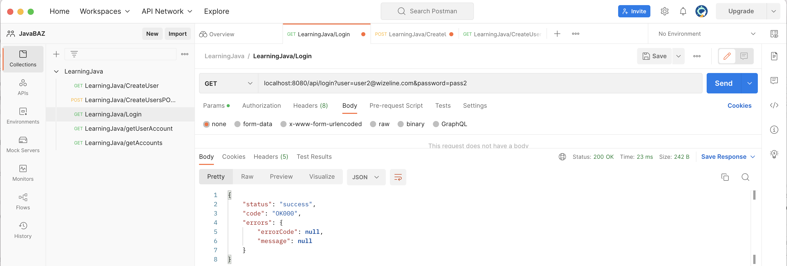

# Spring Boot MVC
Recursos y pasos importantes para el curso

# :computer:  Actividades

## Pre-requisitos de la sesión en vivo :exclamation:

Para realizar este curso es importante tener instalado los siguientes programas::
* [JDK 11](https://www.oracle.com/java/technologies/downloads/)
* [Intellij Idea Community](https://www.jetbrains.com/idea/download/#section=windows)
* [Maven](https://maven.apache.org/download.cgi)

## Java línea de comando
Una vez que JDK y MAVEN sean instalados y configurados, procederemos a validar que este bien instalado para comenzar con la actividad.

### PASO 1: Validar entorno
Abrimos una terminal y validamos si reconoce nuestra versión de Java:

``` bash
# Iniciamos validando que nuestra consola reconosca la versión de Java

jonathan.torres@Jonathans-MacBook-Pro LearningJava1.2 % java -version
java version "11.0.15" 2022-04-19 LTS
Java(TM) SE Runtime Environment 18.9 (build 11.0.15+8-LTS-149)
Java HotSpot(TM) 64-Bit Server VM 18.9 (build 11.0.15+8-LTS-149, mixed mode)

```

Ahora desde una terminal y validamos si reconoce nuestra versión de Maven:

``` bash
# Iniciamos validando que nuestra consola reconosca la versión de Java

jonathan.torres@Jonathans-MacBook-Pro BAZJAVA12022 % mvn -version
Apache Maven 3.8.5 (3599d3414f046de2324203b78ddcf9b5e4388aa0)
Maven home: /Users/jonathan.torres/Open/apache-maven-3.8.5
Java version: 11.0.15, vendor: Oracle Corporation, runtime: /Library/Java/JavaVirtualMachines/jdk-11.0.15.jdk/Contents/Home
Default locale: en_MX, platform encoding: UTF-8
OS name: "mac os x", version: "12.3.1", arch: "x86_64", family: "mac"
jonathan.torres@Jonathans-MacBook-Pro BAZJAVA12022 % 
```

## Temario Día 1

### Spring MVC

Implementación de un servicio MVC, que maneje las capas Controller, Service y Repository


### A continuación, se listaran los pasos a seguir para la actividad de este módulo.

1 . Vamos a cambiar nuestro servicio LearningJava a un servicio MVC de tipo Rest. Comenzamos agregando las siguientes dependencias:

``` bash
		<dependency>
			<groupId>org.springframework.boot</groupId>
			<artifactId>spring-boot-starter-data-rest</artifactId>
		</dependency>
		<dependency>
			<groupId>org.springframework.boot</groupId>
			<artifactId>spring-boot-starter-web</artifactId>
		</dependency>
```

Estas dependencias nos permiten habilitar el servicio REST al usar la anotación @RestController.

2. Ahora vamos a crear un nuevo package en donde vamos a manejar nuestras clases de tipo controller y creamos nuestra primera clase:


Como puedes ver vamos a implementar la anotación @RestController. Esta nos permite exponer nuestro controller para que pueda ser consumido mediante el Mapping definido, en este caso vamos a usar "/api"


3. Continuamos modificando nuestra clase UserServiceImpl, vamos a crear la anotación @Service. Con esto comenzamos a definir las capas de nuestro servicio MVC.


4 Continuamos modificando nuestra clase UserRepositoyImpl, vamos a crear la anotación @Repository. Con esto comenzamos a definir las capas de nuestro servicio MVC.


5. Ya contamos con nuestra con la capa de Service y Repository, comenzomos con la inyección de nuestro service a nivel controller, esto para poder acceder a sus metodos:


6. Ahora moveremos nuestro endpoint que realiza el login, esto lo haremos creando un método con la anotación GetMapping. Esto nos permite definir el path para consumir este servicio de tipo GET el cual será expuesto por la anotación RestController:


7. Ahora moveremos nuestro endpoint que realiza el createUser, esto lo haremos creando un método con la anotación PostMapping. Esto nos permite definir el path para consumir este servicio de tipo POST el cual será expuesto por la anotación RestController:


8. Por el momento vamos a comentar todo nuestro código y funciones que tenemos en nuestro método MAIN:


9. Al final debemos tener lo siguiente:


Recordemos que la anotación SpringBootApplication ya tiene embebida la anotación de MVC, por lo que no es necesario definirla explicitamente. 


10. Probemos levantar nuestro servicio:


11. A continuación, hagamos una prueba con el siguientes request:

``` bash
Request:
localhost:8080/api/createUser
```
``` json
{
    "user":"user2@wizeline.com",
    "password":"pass2"
}
```


12. A continuación, hagamos una prueba con el siguiente request:

``` bash
Request:
localhost:8080/api/login?user=user2@wizeline.com&password=pass2
```




## Practica
La practica consiste crear el resto de Endpoint comentados en el archivo LearningJavaApplication. Puede utilizar la implementación preferida, sin embargo, recuerda utilizar las anotaciones previas.


* [LearningJavaSpring.postman_collection.json](./Postman/LearningJava.postman_collection.json)


# :books: Para aprender mas
* [Spring Initializr](https://start.spring.io/)
* [Spring Boot](https://docs.spring.io/spring-boot/docs/current/reference/htmlsingle/)
* [Spring REST](https://spring.io/projects/spring-restdocs)
* [Spring MVC](https://spring.io/guides/gs/serving-web-content/)
* [Maven Repository](https://mvnrepository.com/)
